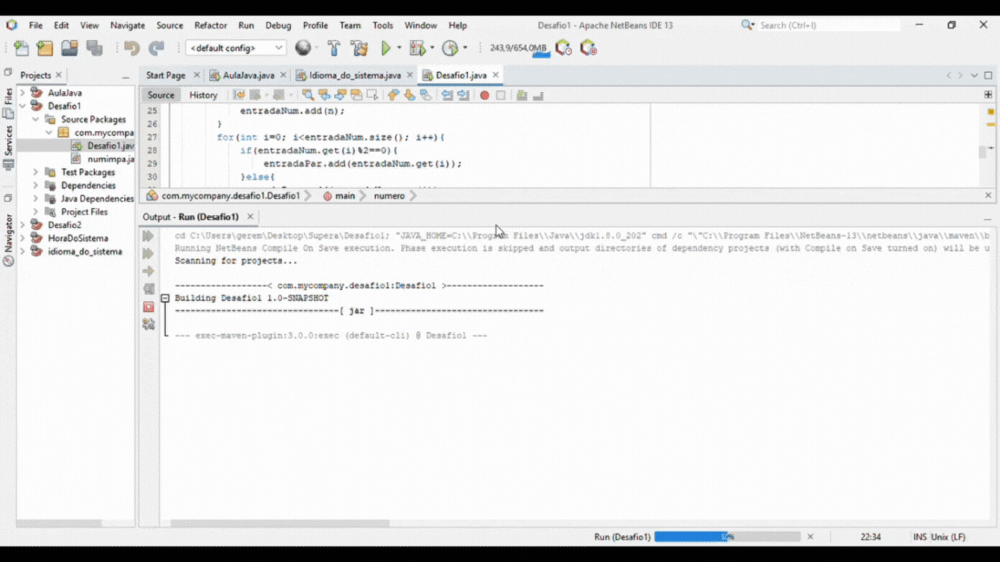

# Supera-Desafios
Foram feitos dois desafios dos quatro proposto. 
  O objetivo deles é medir o nivel de conhecimento na linguagem JAVA. 
## Desafio1
Inserir números inteiros positivos aleatoriamente e o sistema organiza de  
forma em que os positivos sejam colocados em ordem crescente, na parte 
superior e os negativos, em sequência, em ordem decrescente. 

### Como funciona
O primeiro número inserido é a quantidade de números em que o usuário quer ordenar, 
desse modo, o sistema irá aceitar a quantidade indicada e após completar ele executará 
o comando de reorganinzação proposto.

## Desafio2
Inserir um valor real, não negativo, aleatório e ele terá que dizer a menor 
quantidade de notas e/ou moedas para chegar àquele valor.

### Como funciona
O usuário irá inserir um valor em que deseja calcular e ao fazer a entrada desse  
valor, o sistema irá calcular automaticamente o resultado.
